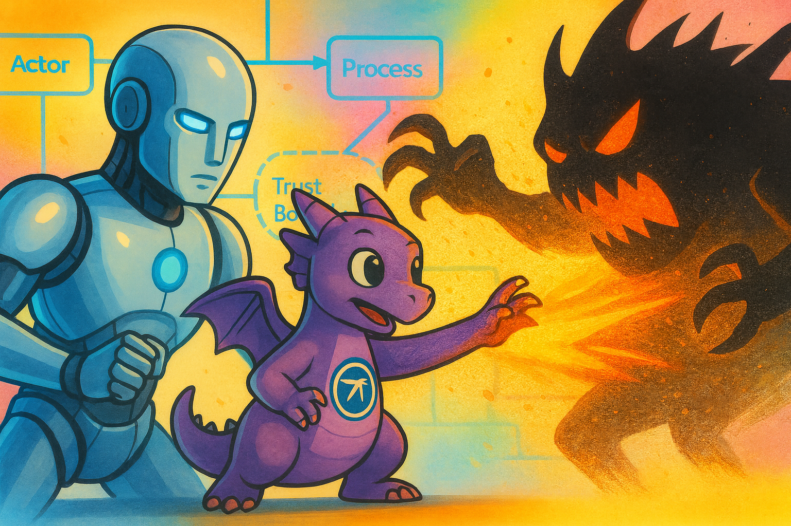

# TD AI Threat Models



A comprehensive collection of Threat Dragon threat models enhanced with AI-generated threat analysis from multiple leading AI providers. Whether you're exploring AI-assisted security analysis or looking for practical threat modeling examples, this repository has you covered.

## Overview

Here you'll find threat models created using [Threat Dragon](https://owasp.org/www-project-threat-dragon/) - the popular open-source threat modeling tool - but with a twist: I've enhanced each model with AI-generated threat analysis from top AI providers including Anthropic, OpenAI, Google, xAI, and Novita. These models span various system architectures, showing you firsthand how AI can revolutionize traditional threat modeling practices.

## AI Threat Generation Tool

**Every single threat model you see here was created using the [td-ai-modeler](https://github.com/InfosecOTB/td-ai-modeler) - a powerful tool that leverages Large Language Models (LLMs) to automatically analyze your system components and generate comprehensive security threats with mitigation strategies for Threat Dragon models.**

### Key Features:

- **AI-Powered Threat Generation**: Uses LLMs to analyze system components and generate comprehensive security threats
- **Multi-LLM Support**: Works with OpenAI, Anthropic, Google, xAI, and Ollama
- **Threat Dragon Integration**: Seamlessly works with Threat Dragon JSON models
- **Data Validation**: Built-in validation ensures threat data integrity
- **Visual Indicators**: Automatically highlights components with threats

For setup instructions, visit the [td-ai-modeler repository](https://github.com/InfosecOTB/td-ai-modeler).

## Repository Structure

This repository contains three threat model categories:

### Folder Organization

Each threat model follows this consistent structure:

```
📁 1_infosecotb/
├── 📄 infosecotb-model.json          # Original Threat Dragon model (no threats)
├── 📁 anthropic/                     # AI-generated threats from Anthropic models
├── 📁 eval_reports/                  # AI model evaluation reports
│   ├── 📁 gpt-5/                     # GPT-5 evaluation reports
│   └── 📁 grok-4-fast-reasoning/     # Grok-4 evaluation reports
├── 📁 google/                        # AI-generated threats from Google models
├── 📁 novita/                        # AI-generated threats from Novita models
├── 📁 openai/                        # AI-generated threats from OpenAI models
└── 📁 xai/                           # AI-generated threats from xAI models

📁 2_husky-ai/
├── 📄 husky-ai-model.json            # Original Threat Dragon model (no threats)
├── 📁 antropic/                      # AI-generated threats from Anthropic models
├── 📁 eval_reports/                  # AI model evaluation reports
│   ├── 📁 gpt-5/                     # GPT-5 evaluation reports
│   └── 📁 grok-4-fast-reasoning/     # Grok-4 evaluation reports
├── 📁 google/                        # AI-generated threats from Google models
├── 📁 novita/                        # AI-generated threats from Novita models
├── 📁 ollama/                        # AI-generated threats from Ollama models
├── 📁 openai/                        # AI-generated threats from OpenAI models
└── 📁 xai/                           # AI-generated threats from xAI models

📁 3_online-payments-processing-platform/
├── 📄 payments-processing-platform.json  # Original Threat Dragon model (no threats)
├── 📁 antropic/                      # AI-generated threats from Anthropic models
├── 📁 eval_reports/                  # AI model evaluation reports
│   ├── 📁 gpt-5/                     # GPT-5 evaluation reports
│   └── 📁 grok-4-fast-reasoning/     # Grok-4 evaluation reports
├── 📁 google/                        # AI-generated threats from Google models
├── 📁 novita/                        # AI-generated threats from Novita models
├── 📁 ollama/                        # AI-generated threats from Ollama models
├── 📁 openai/                        # AI-generated threats from OpenAI models
└── 📁 xai/                           # AI-generated threats from xAI models
```

**Key Points:**
- **Root JSON files**: Each threat model folder contains the original Threat Dragon model without any AI-generated threats
- **AI Provider folders**: Each AI provider has its own folder containing JSON and PDF versions of the enhanced models
- **Dual format**: Every AI-enhanced model comes in both JSON (for Threat Dragon import) and PDF (for documentation) formats
- **Evaluation reports**: The `eval_reports/` folder contains detailed analysis and comparison reports organized by AI model

### 1. InfoSecOTB (Infosecotb.com)
**Location:** `1_infosecotb/`

A cybersecurity blog platform with an AI-powered chatbot system.

**Components:**
- WordPress CMS on BlueHost
- vMeNext AI chatbot with OpenAI GPT
- Blog content management and user engagement

### 2. Husky AI
**Location:** `2_husky-ai/`

A machine learning system for classifying huskies vs. other dogs.

**Components:**
- CNN for image classification
- Azure Cognitive Services
- Azure Blob Storage with RBAC/ABAC
- Jupyter Notebook development
- Production API Gateway

### 3. Online Payments Processing Platform
**Location:** `3_online-payments-processing-platform/`

An e-commerce payment processing system based on OWASP Threat Model Cookbook.

**Components:**
- Customer-merchant interaction flows
- Stripe payment integration
- OAuth authentication
- Secure payment processing

## AI Provider Analysis

Each threat model includes AI-generated threat analysis from multiple providers:

- **Anthropic**: Claude Opus 4.1 and Claude Sonnet 4.5
- **OpenAI**: GPT-5 and GPT-5 Mini
- **Google**: Gemini 2.5 Pro
- **xAI**: Grok-4 (latest and fast-reasoning variants)
- **Novita**: DeepSeek R1, DeepSeek V3.1 Terminus, and Qwen3 Coder
- **Ollama**: Gemma 3 27B (for Husky AI)

## File Formats

Each AI-generated threat model is available in two formats:
- **JSON**: Threat Dragon format for import
- **PDF**: Human-readable reports for documentation

## Contributing

This repository serves as a reference for AI-enhanced threat modeling. The models are educational and demonstrative.

## License

This project is licensed under the Apache 2.0 License - see the [LICENSE](LICENSE) file for details.

## Related Resources

- [Threat Dragon Official Documentation](https://www.threatdragon.com/docs/)
- [STRIDE Threat Modeling Framework](https://docs.microsoft.com/en-us/azure/security/develop/threat-modeling-tool-threats)

## Disclaimer

These threat models are for educational purposes. They should not be used as the sole basis for security decisions in production systems.
