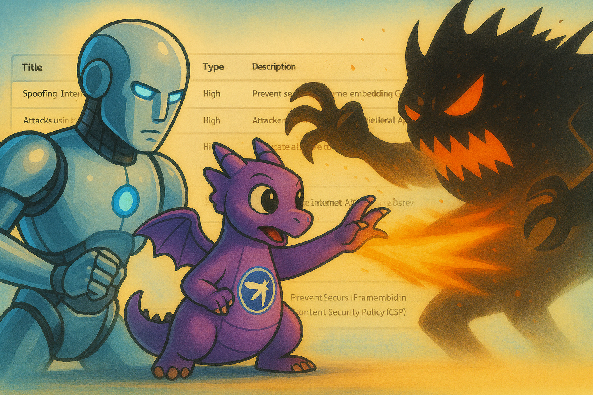

# TD AI Threat Models

A comprehensive collection of Threat Dragon threat models enhanced with AI-generated threat analysis from multiple leading AI providers.

## Overview

This repository contains threat models created using [Threat Dragon](https://owasp.org/www-project-threat-dragon/) - an open-source threat modeling tool - with additional AI-generated threat analysis from various AI providers including Anthropic, OpenAI, Google, xAI, and Novita. The models cover different system architectures and demonstrate how AI can enhance traditional threat modeling practices.

## AI Threat Generation Tool

**All threat models in this repository were generated using the [td-ai-modeler](https://github.com/InfosecOTB/td-ai-modeler) - an intelligent threat modeling application that uses Large Language Models (LLMs) to automatically generate security threats and their mitigation proposals for Threat Dragon models.**

### Key Features of td-ai-modeler:

- **AI-Powered Threat Generation**: Uses state-of-the-art LLMs to analyze system components and generate comprehensive security threats
- **Threat Framework Support**: Supports STRIDE threat modeling framework with extensibility for other frameworks
- **Multi-LLM Support**: Tested on OpenAI, Anthropic, Google, xAI, and Ollama using the LiteLLM library
- **Threat Dragon Integration**: Works seamlessly with Threat Dragon JSON models
- **Smart Filtering**: Automatically skips out-of-scope components
- **Data Validation**: Built-in Pydantic validation for threat data integrity
- **Response Validation**: Comprehensive validation of AI responses against original models
- **Validation Logging**: Timestamped validation logs with detailed coverage reports
- **Visual Indicators**: Automatically adds visual cues (red strokes) to components with threats

### Supported AI Providers:
- **OpenAI**: GPT-5, GPT-5 Mini
- **Anthropic**: Claude Opus 4.1, Claude Sonnet 4.5
- **Google**: Gemini 2.5 Pro
- **xAI**: Grok-4 (latest and fast-reasoning variants)
- **Novita**: DeepSeek R1, DeepSeek V3.1 Terminus, Qwen3 Coder
- **Ollama**: Gemma 3 27B (local deployment)

For detailed information on how to use the td-ai-modeler tool, visit the [official repository](https://github.com/InfosecOTB/td-ai-modeler).

## Repository Structure

The repository is organized into three main threat model categories:

### 1. InfoSecOTB (Infosecotb.com)
**Location:** `1_infosecotb/`

A cybersecurity blog platform built on WordPress with an integrated vMeNext AI-powered chatbot system. This model demonstrates threats in content management systems with AI integration.

**Key Components:**
- WordPress CMS on BlueHost hosting
- vMeNext AI chatbot with OpenAI GPT integration
- Blog content management and user engagement features
- Social media integration and search functionality

### 2. Husky AI
**Location:** `2_husky-ai/`

A machine learning system designed to classify images of huskies vs. other dogs. This model showcases threats in ML/AI systems with secure data handling practices.

**Key Components:**
- Convolutional Neural Network (CNN) for image classification
- Azure Cognitive Services for image retrieval
- Azure Blob Storage with RBAC/ABAC access controls
- Jupyter Notebook development environment
- Production deployment with API Gateway

### 3. Online Payments Processing Platform
**Location:** `3_online-payments-processing-platform/`

A payment processing system based on the OWASP Threat Model Cookbook example, demonstrating e-commerce payment flow security.

**Key Components:**
- Customer-merchant interaction flow
- Stripe payment integration
- OAuth authentication
- Secure payment processing workflow

## AI Provider Analysis

Each threat model includes AI-generated threat analysis from multiple providers:

- **Anthropic**: Claude Opus 4.1 and Claude Sonnet 4.5
- **OpenAI**: GPT-5 and GPT-5 Mini
- **Google**: Gemini 2.5 Pro
- **xAI**: Grok-4 (latest and fast-reasoning variants)
- **Novita**: DeepSeek R1, DeepSeek V3.1 Terminus, and Qwen3 Coder
- **Ollama**: Gemma 3 27B (for Husky AI)

## File Formats

Each AI-generated threat model is available in two formats:
- **JSON**: Raw Threat Dragon format for import into Threat Dragon
- **PDF**: Human-readable report format for documentation and sharing

## Getting Started

### Prerequisites

- [Threat Dragon](https://owasp.org/www-project-threat-dragon/) (web application or desktop version)
- Web browser for viewing PDF reports

### Viewing Threat Models

1. **JSON Files**: Import directly into Threat Dragon for interactive viewing and editing
2. **PDF Files**: Open in any PDF viewer for static documentation

### Using in Threat Dragon

1. Open [Threat Dragon](https://www.threatdragon.com/#/)
2. Create a new model or open existing
3. Use the import feature to load any `.json` file from this repository
4. Explore the threat analysis and diagrams

### Reproducing These Results

To generate similar AI-enhanced threat models use td-ai-modeler tool.

For detailed setup instructions, see the [td-ai-modeler documentation](https://github.com/InfosecOTB/td-ai-modeler).

## AI-Enhanced Threat Modeling

This repository demonstrates how the [td-ai-modeler](https://github.com/InfosecOTB/td-ai-modeler) tool can augment traditional threat modeling by:

- **Automated Threat Generation**: AI models automatically analyze system components and generate comprehensive threats using the STRIDE framework
- **Comprehensive Threat Identification**: AI models identify threats that might be missed in manual analysis
- **Consistent Analysis**: Standardized threat analysis across different system types and AI providers
- **Multiple Perspectives**: Different AI models provide varied viewpoints on the same system architecture
- **Automated Documentation**: AI-generated detailed threat descriptions, mitigations, and visual indicators
- **Quality Assurance**: Built-in validation ensures all generated threats meet Threat Dragon standards
- **Scalability**: Process multiple threat models efficiently with different AI providers

## Contributing

This repository serves as a reference for AI-enhanced threat modeling. While the models are based on real or realistic scenarios, they are primarily educational and demonstrative.

## License

This project is licensed under the MIT License - see the [LICENSE](LICENSE) file for details.

## Related Resources

- [Threat Dragon Official Documentation](https://www.threatdragon.com/docs/)
- [OWASP Threat Model Cookbook](https://github.com/wunderwuzzi23/threat-model-cookbook)
- [STRIDE Threat Modeling Framework](https://docs.microsoft.com/en-us/azure/security/develop/threat-modeling-tool-threats)

## Disclaimer

These threat models are for educational and demonstration purposes. They should not be used as the sole basis for security decisions in production systems. Always conduct thorough security assessments for your specific use cases.
